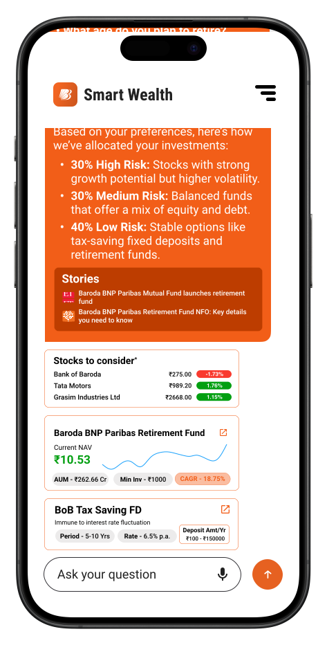

# Smart-Wealth

## Description

Smart Wealth is your AI-powered financial advisor, providing personalized investment strategies, real-time market insights, and tailored financial planning to help you achieve your goals.

## Mockups

## Agent Architecture

## Architecture

## Features

- **Personalized Investment Strategies**: Smart Wealth uses machine learning algorithms to analyze your financial situation and risk tolerance, and provides personalized investment strategies to help you achieve your goals.

- **Real-Time Market Insights**: Smart Wealth provides real-time market insights, including stock prices, market trends, and investment opportunities, to help you make informed investment decisions.

- **Tailored Financial Planning**: Smart Wealth creates a tailored financial plan based on your financial goals, risk tolerance, and investment preferences, and helps you track your progress towards your goals.

## Technologies

- **Advanced Retrieval Strategies**:
    - RAG Fusion enhances document retrieval by incorporating Reciprocal Ranking.
    - Semantic chunking ensures that related content are grouped together during document chunking.
    - Semantic caching caches queries and responses for faster retrieval of repeated questions.

- **Parallel Processing**:
    - Enhances efficiency and enables faster computations.

- **Reinforcement Learning Agent**:
    - Optimizes investment strategies over time by learning from market conditions using Deep Reinforcement Learning algorithms.
    - This development builds on a previous project - [https://github.com/vsaravind01/RL-Portfolio-Allocator](https://github.com/vsaravind01/RL-Portfolio-Allocator)
